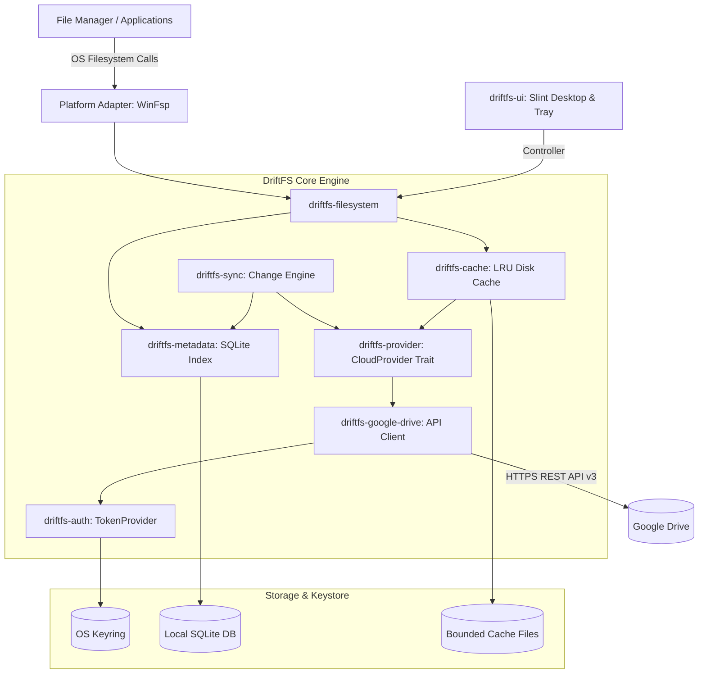

# DriftFS

[](#license)
[](https://www.rust-lang.org)
[-blue.svg)](#prerequisites)

A lightweight virtual filesystem that exposes Google Drive as a native local drive on Windows without full local synchronization. Linux and macOS adapters are planned for a future release.

---

## How It Works

Traditional cloud storage clients synchronize files by downloading entire directories to your local disk, consuming storage and network bandwidth:

```
Traditional sync client:
Cloud ──────────────────────→ Full local copy (downloads all files)

DriftFS:
Cloud ←─────────────────────→ Virtual Filesystem (mounts as G:\)
              ↕
       Local SQLite Index
       Bounded LRU Cache
       On-Demand Range I/O
```

Files appear in Windows Explorer instantly. Content chunks are fetched on demand when opened, stored in a bounded local cache, and evicted using an LRU policy when storage limits are reached.

---

## Features

- **Native Mount**: Mount Google Drive as a native drive letter (e.g. `G:\` on Windows) via WinFsp.
- **Read-Write Access**: Create files, rename, move, and delete; mutations stream back to Google Drive.
- **On-Demand Range I/O**: File content streams on access without downloading full contents upfront.
- **Bounded Local Cache**: Fixed maximum cache size with LRU chunk eviction and watermark thresholds.
- **Incremental Metadata Sync**: Local SQLite index with change token tracking for fast listings and low API overhead.
- **Secure by Default**: Zero plaintext secrets on disk; OAuth tokens live in the OS credential manager (Windows Credential Manager).
- **Desktop Dashboard**: Slint-based system tray application with account management, mount controls, and sync status.

---

## System Architecture



For detailed component interaction, sequence diagrams, and security models, see [docs/architecture.md](docs/architecture.md).

---

## Quick Start

### Prerequisites

| Dependency | Minimum Version | Note |
|---|---|---|
| [Rust](https://rustup.rs/) | 1.75+ | Stable toolchain |
| [WinFsp](https://winfsp.dev/) | 2.0+ | Install with "Developer" feature enabled |
| C++ Compiler | MSVC | Via Visual Studio Installer or Build Tools for Visual Studio |

### 1. Clone & Build

```sh
git clone https://github.com/shditz/DriftFS.git
cd DriftFS
cargo build --all-targets
```

### 2. Configure Google OAuth

DriftFS authenticates via OAuth 2.0 PKCE with tokens committed directly to your native OS Keyring (Windows Credential Manager). Configure local filesystem and cache parameters in `config.toml` (or copy from [`config.example.toml`](config.example.toml)):

```toml
# %APPDATA%\DriftFS\config.toml

version = 1

[mount]
mount_point = "G:"
auto_mount = false

[cache]
directory = ""               # Defaults to %LOCALAPPDATA%\driftfs\cache
max_size_bytes = 536870912   # 512 MB

[network]
max_concurrent_requests = 4
prefetch_enabled = true

[sync]
poll_interval_secs = 60

[logging]
level = "info"
```

> **Note:** DriftFS reads configuration exclusively from `config.toml` and the OS Keyring. Environment variables and `.env` files are not used for credential configuration.

### 3. Run the Desktop Application

```sh
cargo run -p driftfs-ui
```

The application starts in the system tray. Right-click the tray icon to access mount controls, account management, and sync status.

### 4. Run Tests

```sh
cargo test --all            # test suite
cargo fmt --all -- --check  # formatting
cargo clippy --all-targets  # linter
```

---

## Configuration

DriftFS stores user configuration and local metadata in standard OS application directories:

* **Configuration File:** `%APPDATA%\DriftFS\config.toml` (see [`config.example.toml`](config.example.toml))
* **Metadata Database:** `%APPDATA%\DriftFS\metadata_{account_id}.db`
* **OAuth Tokens:** Windows Credential Manager (never written to disk)

For comprehensive setup details and platform requirements, see the [Installation Guide](docs/installation.md).

### Environment Variables

| Variable | Description | Default |
|---|---|---|
| `DRIFTFS_LOG` | Tracing log filter directive (`error`, `warn`, `info`, `debug`, `trace`) | `info` |
| `DRIFTFS_LOG_SECRETS` | If set in debug builds, shows redacted token previews in log output | Unset |

---

## Workspace Crates

The DriftFS repository is structured as a Cargo workspace:

| Crate | Path | Description |
|---|---|---|
| [`driftfs-ui`](apps/driftfs-ui) | `apps/driftfs-ui` | Desktop GUI dashboard and Windows system tray controller (Slint + tray-icon) |
| [`driftfs-core`](crates/driftfs-core) | `crates/driftfs-core` | Domain primitives (`FileId`, `AccountId`, `ByteRange`) and `DriftFsError` |
| [`driftfs-config`](crates/driftfs-config) | `crates/driftfs-config` | Configuration schema parsing and serialization |
| [`driftfs-logging`](crates/driftfs-logging) | `crates/driftfs-logging` | Structured tracing initialization and secret redaction |
| [`driftfs-provider`](crates/driftfs-provider) | `crates/driftfs-provider` | Provider-agnostic `CloudProvider` trait and types |
| [`driftfs-auth`](crates/driftfs-auth) | `crates/driftfs-auth` | OAuth 2.0 PKCE flow, loopback server, and OS keyring storage |
| [`driftfs-google-drive`](crates/driftfs-google-drive) | `crates/driftfs-google-drive` | Google Drive API v3 HTTP client and data mapper |
| [`driftfs-metadata`](crates/driftfs-metadata) | `crates/driftfs-metadata` | SQLite metadata index, hierarchy store, and persistent staging journal |
| [`driftfs-sync`](crates/driftfs-sync) | `crates/driftfs-sync` | Incremental change synchronization engine |
| [`driftfs-cache`](crates/driftfs-cache) | `crates/driftfs-cache` | Bounded local LRU chunk cache with watermark eviction and prefetch |
| [`driftfs-filesystem`](crates/driftfs-filesystem) | `crates/driftfs-filesystem` | Platform-agnostic VFS interface, path resolver, and crash recovery |
| [`driftfs-platform-windows`](platforms/windows) | `platforms/windows` | Windows WinFsp read-write filesystem adapter |
| [`driftfs-platform-linux`](platforms/linux) | `platforms/linux` | Linux FUSE 3 platform adapter skeleton |
| [`driftfs-platform-macos`](platforms/macos) | `platforms/macos` | macOS macFUSE platform adapter skeleton |
| [`driftfs-testkit`](crates/driftfs-testkit) | `crates/driftfs-testkit` | Mock provider, fault injection engine, and deterministic test helpers |

---

## Documentation

Technical guides and specifications are located in the [`docs/`](docs) directory:

- [Architecture & Data Flow](docs/architecture.md): System design, crate responsibilities, and security model.
- [Installation Guide](docs/installation.md): Windows setup, WinFsp requirements, and OAuth configuration.
- [Troubleshooting](docs/troubleshooting.md): Solutions for common WinFsp, network, and keyring issues.
- [Release Guide](docs/release-guide.md): Versioning policy and maintainer release checklists.
- [Changelog](CHANGELOG.md): Release notes and version history.

---

## Platform Support

| Platform | Virtual Filesystem Adapter | Status | Guide |
|---|---|---|---|
| **Windows 10/11** | WinFsp 2.0+ | ✅ Supported (Read-Write) | [Installation Guide](docs/installation.md) |
| **Linux** | FUSE 3 | 🏗️ Scaffolding Ready | [Linux README](platforms/linux/README.md) |
| **macOS** | macFUSE / FileProvider | 🏗️ Scaffolding Ready | [macOS README](platforms/macos/README.md) |

---

## Contributing

Contributions are welcome. Please ensure your changes:

1. Maintain minimal code-comment hygiene: document non-obvious invariants and public API contracts only.
2. Pass formatting checks: `cargo fmt --all -- --check`.
3. Pass linter checks: `cargo clippy --all-targets`.
4. Pass all test suites: `cargo test --all`.

See [CONTRIBUTING.md](CONTRIBUTING.md) for detailed guidelines and [SECURITY.md](SECURITY.md) for vulnerability reporting.

---

## License

Licensed under either of:

- [Apache License, Version 2.0](LICENSE-APACHE)
- [MIT license](LICENSE-MIT)

at your option.
