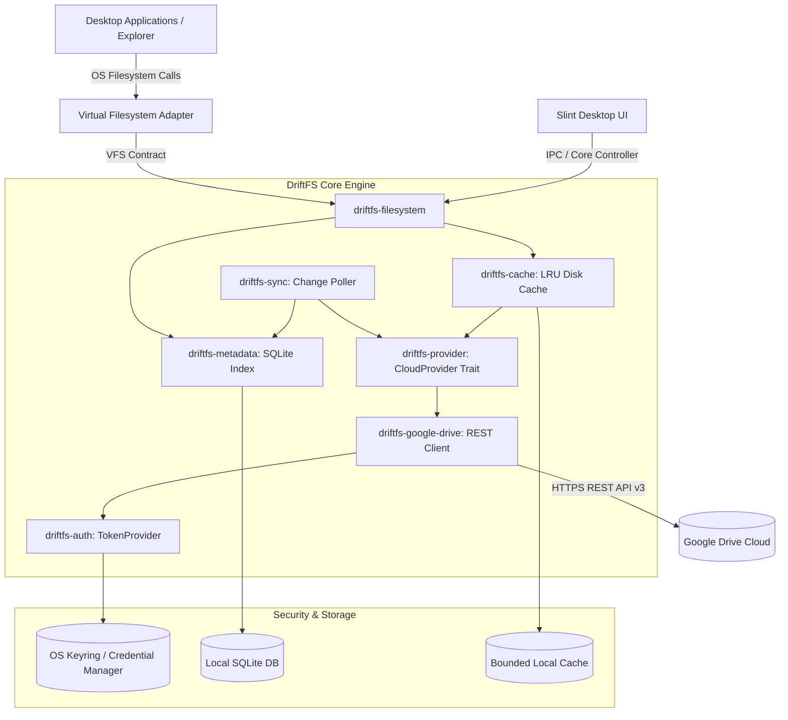
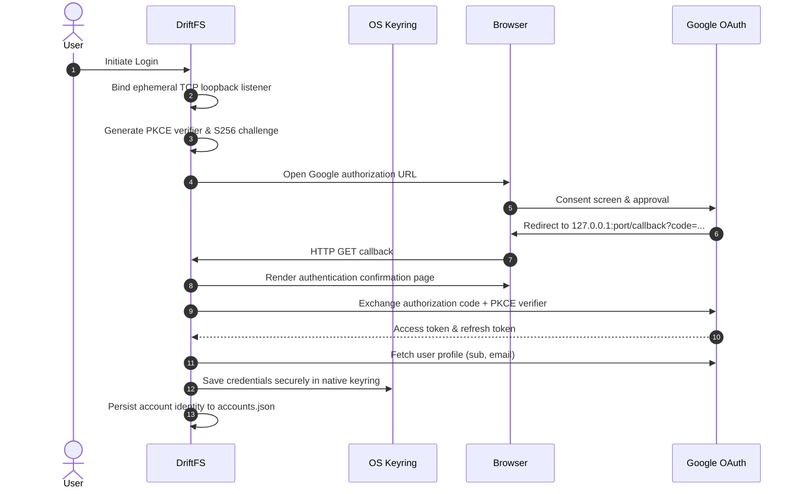
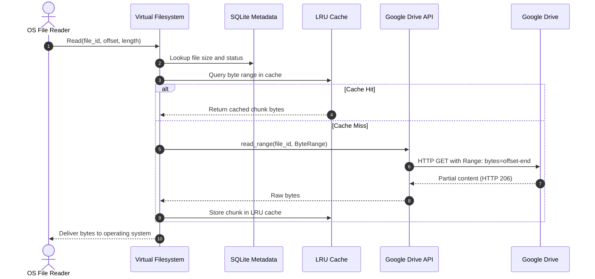
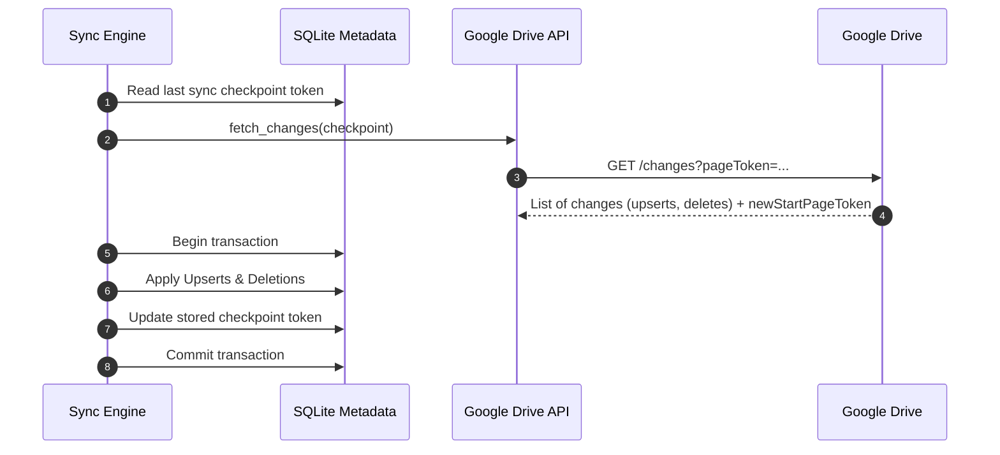
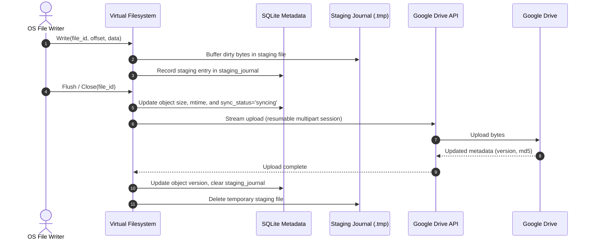

# DriftFS Architecture

This document describes the architectural design, core subsystems, data flows, and security model of DriftFS.

## Overview

DriftFS is a lightweight virtual filesystem (VFS) client that exposes remote cloud storage (Google Drive) as a native local drive without requiring full local synchronization. Instead, DriftFS stores metadata in a local SQLite database, fetches byte ranges on demand, and maintains a bounded local disk cache with LRU eviction.



## Core Subsystems

| Crate | Purpose | Key Responsibilities |
|---|---|---|
| `driftfs-core` | Domain primitives & errors | `FileId`, `AccountId`, `ByteRange`, `DriftFsError` hierarchy |
| `driftfs-config` | Configuration management | Versioned schema, TOML serialization, OS-specific default paths |
| `driftfs-logging` | Observability & safety | Tracing subscriber initialization, runtime secret token redaction |
| `driftfs-provider` | Provider abstraction | `CloudProvider` trait, `ObjectMetadata`, `ChangePage`, read range output |
| `driftfs-auth` | Authentication & tokens | PKCE OAuth 2.0 flow, loopback TCP listener, OS keyring integration |
| `driftfs-google-drive` | Cloud adapter | Google Drive API v3 client, exponential backoff, response mapping |
| `driftfs-metadata` | Metadata indexing | SQLite schema, hierarchical queries, sync checkpoint tracking |
| `driftfs-sync` | Incremental synchronization | Remote change stream polling, conflict detection, checkpoint advance |
| `driftfs-cache` | Local data cache | Bounded size enforcement, LRU watermark eviction, chunk-level caching |
| `driftfs-filesystem` | Virtual filesystem contract | VFS operations, mount state machine, request dispatch |
| `driftfs-platform-windows` | Windows adapter | WinFsp read-write filesystem adapter, drive letter mount |
| `driftfs-platform-linux` | Linux adapter | FUSE 3 filesystem adapter scaffolding and mount configuration |
| `driftfs-platform-macos` | macOS adapter | macFUSE filesystem adapter scaffolding and mount configuration |
| `driftfs-ui` | Desktop application | Slint GUI dashboard, system tray controller, account management |
| `driftfs-testkit` | Testing infrastructure | In-memory `MockProvider`, test harnesses, deterministic fixtures |

## Key Data Flows

### 1. Authentication Flow



### 2. On-Demand Read Flow



### 3. Incremental Change Synchronization Flow



### 4. Write & Mutation Pipeline Flow



### 5. Cache Eviction & Prefetching

The `driftfs-cache` crate implements a bounded chunk cache with watermark-based LRU eviction:

- **Chunk Size**: Files are divided into fixed-size chunks (default: 256 KB). Each chunk is stored as an individual file on disk.
- **Capacity Limit**: The cache enforces a maximum byte budget configured via `cache.max_size_bytes` in `config.toml` (default: 512 MB).
- **Watermark Eviction**: When a new chunk would push total cached bytes above the capacity limit, the cache evicts the least-recently-used chunks until total size falls to 85% of the maximum (the low watermark). This prevents thrashing by creating headroom for incoming data.
- **Sequential Prefetch**: When `network.prefetch_enabled` is `true` and a sequential read pattern is detected, the cache proactively fetches the next chunk before the application requests it, reducing perceived latency for large file reads.
- **Crash Recovery**: On startup, the cache scans its directory, re-indexes valid `.chunk` files into the LRU tracker, and removes any orphaned or corrupt chunk files.

```
  Cache capacity: |████████████████████░░░░| 85% low watermark
                  |████████████████████████| 100% triggers eviction
                                             ↓
                  Evict LRU chunks until ≤ 85%
```

## Security Invariants

1. **Zero Plaintext Secrets on Disk**: OAuth access and refresh tokens are strictly stored using native operating system secret services (Windows Credential Manager, macOS Keychain, Linux secret-service via `keyring`). Non-sensitive metadata (`accounts.json`) contains only provider identifiers and user email.
2. **Secret Redaction**: `SecretToken` implements a custom `Debug` formatter that redacts secret strings as `[REDACTED]`. The `driftfs-logging` helper guards against secret token exposure in log streams.
3. **PKCE (RFC 7636)**: Authorization flows use 64-character high-entropy verifiers with SHA-256 challenges, preventing authorization code interception attacks.
4. **Crash Safety**: In-memory registry and metadata files utilize atomic write-and-rename semantics (`.tmp` write followed by rename) to prevent state corruption during sudden process termination or power loss.
5. **Metadata Atomic Transaction**: Applying remote change batches (`objects`) and advancing the synchronization token (`sync_checkpoints`) strictly occurs within a single atomic SQLite transaction, ensuring crash consistency and zero state drift.
6. **Local Database & Name Disambiguation**: The local SQLite database (`%LOCALAPPDATA%\DriftFS\metadata.db`) operates in WAL mode (`PRAGMA journal_mode = WAL; PRAGMA synchronous = NORMAL;`). Remote name collisions in identical parent directories are automatically disambiguated with stable local display names (`name`) while preserving original cloud identities (`remote_name`).
7. **Google Workspace File Pointers**: Native cloud documents (`application/vnd.google-apps.*` such as Docs, Sheets, Slides) do not have raw binary content. DriftFS surfaces them as `.url` Windows Internet Shortcuts with Google Docs target URLs, avoiding runtime binary read failures and enabling direct browser viewing when clicked.

