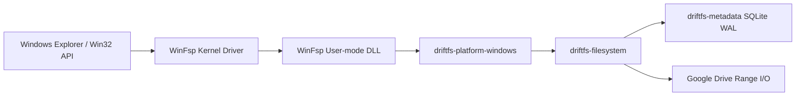

# Windows Platform Adapter (`driftfs-platform-windows`)

WinFsp-based filesystem adapter that exposes the DriftFS virtual filesystem to Windows as a native drive letter (e.g. `G:\`).

## Prerequisites

- Windows 10 / 11 (x64)
- [WinFsp](https://winfsp.dev/) 2.0 or newer.
- MSVC C++ Build Tools (via Visual Studio Installer or Build Tools for Visual Studio).

## Architecture

This adapter implements `winfsp_wrs::FileSystemInterface` and delegates operations to `driftfs-filesystem`:



## Key Capabilities

- **Read-Write Virtual Mount**: Exposes an available drive letter (defaulting to G: through Z:) with full read-write support.
- **File Mutations**: Create files, create directories, rename, move across directories, delete files, and remove directories; all streamed back to Google Drive.
- **Directory Hierarchy**: Traverses directories and child objects stored in SQLite without full disk replication.
- **On-Demand Range Reads**: Streams file data over HTTP range requests as requested by Windows Explorer or applications.
- **Streaming Writes**: Write operations buffer locally and upload to Google Drive on flush/close.
- **Google Workspace Items**: Synthesizes `.url` Windows Internet Shortcuts on the fly for Google Docs, Sheets, and Slides.
- **Clean Lifecycle**: Drops or unmounts the WinFsp dispatcher cleanly on exit or shutdown signal.

## Testing

```bash
cargo test -p driftfs-platform-windows
```
